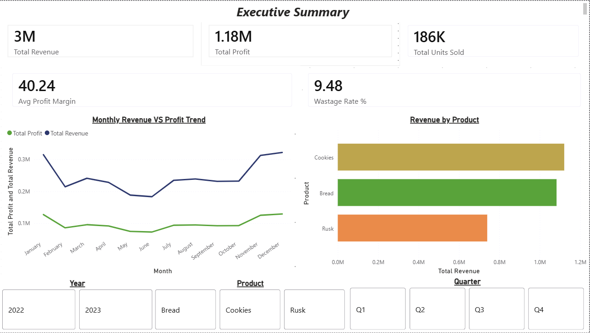
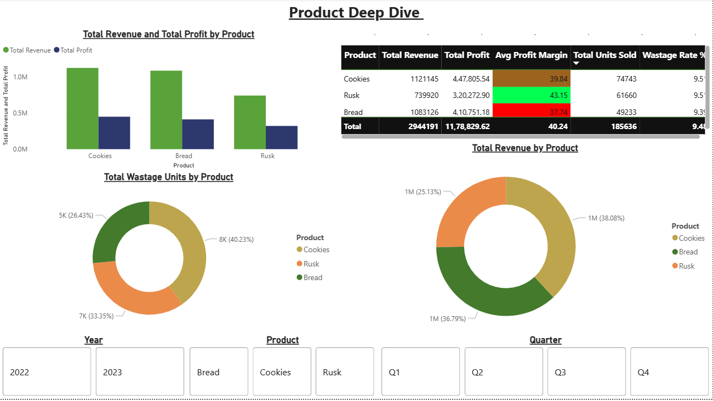
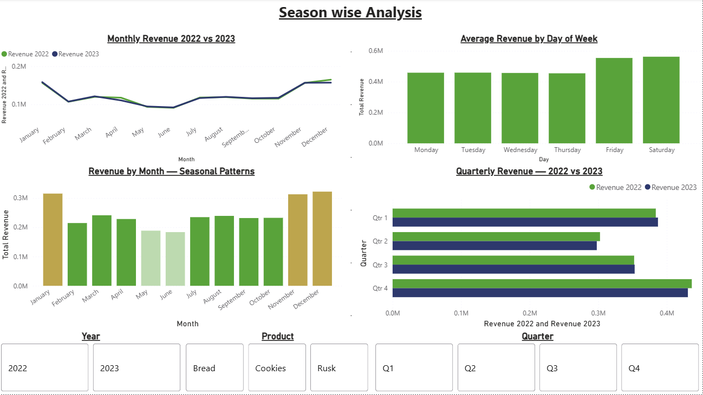
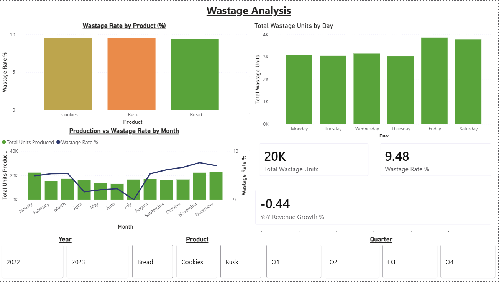

# 🍞 XYZ Foods — Sales & Operations Analysis

> An end-to-end data analysis project using Python, SQL and Power BI on 2 years of daily bakery sales data — built on real operations data from a working FMCG bakery.

---

## 📌 Project Overview

This project analyses 2 years of daily sales and operations data (Jan 2022 – Dec 2023) from XYZ Foods, a bakery business based in India manufacturing **Cookies, Bread and Rusk**.

The goal was to move beyond manual Excel tracking and build a full data pipeline — from raw data to interactive dashboard — uncovering actionable business insights along the way.

**Headline numbers:** ₹2.94M revenue · ₹1.18M profit · 185,636 units sold · 40.24% average profit margin · 9.48% wastage rate.

---

## 💡 Key Insights

- **Rusk is the margin champion, not the revenue leader.** Despite the *lowest* revenue (₹0.74M), Rusk carries the **highest profit margin at 43.15%** — well above Cookies (39.84%) and Bread (37.74%). The product that sells most isn't the one that earns most per rupee, which is a direct pricing and product-mix signal.
- **Bread earns the most per unit.** At ~₹22 revenue per unit, Bread out-earns Cookies (~₹15) and Rusk (~₹12) on a per-unit basis despite selling the fewest units — a premium-product dynamic worth protecting.
- **Cookies drive volume but also waste.** Cookies lead on units sold (74,743) and revenue (₹1.12M), but also account for **40% of all wastage units** — the clearest target for production-planning improvement.
- **Revenue plateaued year-over-year: −0.44%.** Revenue was essentially flat from 2022 to 2023 (a marginal decline), not growth. A stable but stagnant top line is the real story — and the case for the demand-forecasting and reorder work that followed.
- **Strong seasonality.** **November–January is peak season** (festival and winter demand); **May–June is the consistent trough** across all products. Q4 is the strongest quarter in both years.
- **Friday and Saturday are the best trading days**, generating the highest average daily revenue — and, correspondingly, the highest daily wastage, since output rises to meet demand.
- **Wastage is high but remarkably even** — ~9.3–9.5% across all three products. Consistency across products points to a systemic production process to optimise rather than one problem SKU.

---

## 📊 Dashboard

### Page 1 — Executive Summary
*Top-line KPIs, monthly revenue vs profit trend, and revenue by product.*



### Page 2 — Product Deep Dive
*Revenue, profit, margin, and wastage broken down per product.*



### Page 3 — Seasonal & Time Analysis
*2022 vs 2023 comparison, monthly seasonal patterns, day-of-week, and quarterly trends.*



### Page 4 — Wastage & Operations
*Wastage rate by product and day, production vs wastage by month, and YoY growth.*



---

## 🎯 Business Questions Answered

- Which product generates the most revenue, and which earns the most profit per unit?
- What seasonal demand patterns exist across the year?
- Which months and days of the week perform best?
- Where is wastage highest — and what does it cost the business?
- How did revenue and profit change from 2022 to 2023?

---

## 🛠️ Tools & Technologies

| Tool | Purpose |
| --- | --- |
| Python (Pandas, Matplotlib, Seaborn) | Data cleaning, EDA, visualisations |
| Microsoft SQL Server | Data storage, business queries, stored procedures |
| Power BI (DAX) | Interactive 4-page dashboard |
| Microsoft Excel | Source data & manual tracking reference |
| Google Colab | Python notebook environment |

---

## 📁 Repository Structure

```
XYZ-Foods-analysis/
│
├── data/
│   └── XYZ_Foods_sales_data.csv        # 2-year daily sales dataset (1,875 rows)
│
├── python/
│   └── XYZ_Foods_Analysis.ipynb        # Full EDA notebook (11 steps, 6 charts)
│
├── sql/
│   └── XYZ_Foods_SQL_Analysis.sql      # 10 business questions + stored procedure
│
├── powerbi/
│   └── XYZ_Foods_Dashboard.pbix        # 4-page interactive Power BI dashboard
│
├── images/
│   ├── 01_executive_summary.png
│   ├── 02_product_deep_dive.png
│   ├── 03_seasonal_analysis.png
│   └── 04_wastage_analysis.png
│
└── README.md
```

---

## 📊 Dataset Overview

| Detail | Value |
| --- | --- |
| Total rows | 1,875 |
| Date range | Jan 2022 — Dec 2023 |
| Products | Cookies, Bread, Rusk |
| Working days | Mon – Sat (Sundays closed) |

**Columns:**

| Column | Description |
| --- | --- |
| Date, Month, Year, Quarter, Day_of_Week | Time dimensions |
| Product | Cookies / Bread / Rusk |
| Units_Produced | Daily production volume |
| Units_Sold | Actual units sold |
| Wastage_Units | Unsold or damaged units |
| Raw_Material_Cost_INR | Production cost in ₹ |
| Revenue_INR | Sales revenue in ₹ |
| Profit_INR | Revenue minus cost |
| Profit_Margin_Pct | Profit as % of revenue |

---

## 🐍 Python Analysis (Google Colab)

**File:** `python/XYZ_Foods_Analysis.ipynb`

The notebook covers 11 steps:

1. Import libraries
2. Load dataset
3. Data overview & quality check
4. Business KPIs summary
5. Monthly revenue vs profit trend
6. Product performance comparison
7. Seasonal demand analysis
8. Day of week performance
9. Wastage analysis by product
10. Year on year comparison
11. Key insights summary

**Charts produced:**

- Monthly revenue & profit trend line chart
- Product revenue, profit & margin bar charts
- Seasonal demand column chart with annotations
- Day of week revenue vs wastage dual-axis chart
- Wastage rate bar chart + pie chart by product
- Year on year revenue comparison

**To run:**

1. Open [Google Colab](https://colab.research.google.com)
2. Upload `XYZ_Foods_Analysis.ipynb`
3. Upload `XYZ_Foods_sales_data.csv` to the Files panel
4. Runtime → Run all

---

## 🗄️ SQL Analysis (MS SQL Server)

**File:** `sql/XYZ_Foods_SQL_Analysis.sql`

10 business questions answered with SQL:

| # | Business Question |
| --- | --- |
| Q1 | Total revenue, profit and cost by year |
| Q2 | Which product generates the most revenue and profit? |
| Q3 | Top 5 best performing months |
| Q4 | Top 5 worst performing months |
| Q5 | Which day of the week has the highest average revenue? |
| Q6 | Wastage rate and estimated cost of waste per product |
| Q7 | Quarter by quarter revenue comparison |
| Q8 | Year on year revenue growth by product |
| Q9 | Top 10 single best sales days |
| Q10 | Rolling 30-day average revenue trend (window function) |
| Bonus | Stored procedure: `GetMonthlyReport` for any month/year |

**To run:**

1. Open SQL Server Management Studio (SSMS)
2. Run Step 1 to create the database and table
3. Right-click `XYZFoods` → Tasks → Import Flat File → select the CSV
4. Run each query section individually

---

## 📈 Power BI Dashboard

**File:** `powerbi/XYZ_Foods_Dashboard.pbix`

4-page interactive dashboard:

| Page | Content |
| --- | --- |
| 1. Executive Summary | 5 KPI cards, monthly trend line, revenue by product |
| 2. Product Deep Dive | Revenue/profit bars, full metrics table, wastage & revenue donuts |
| 3. Seasonal & Time Analysis | 2022 vs 2023 comparison, seasonal patterns, day of week, quarterly |
| 4. Wastage & Operations | Wastage rate by product/day, production vs wastage combo, YoY growth |

**DAX Measures built:**

- Total Revenue, Total Profit, Total Cost
- Avg Profit Margin %, Wastage Rate %
- Total Units Sold, Total Units Produced, Total Wastage Units
- Revenue 2022, Revenue 2023, YoY Revenue Growth %

**Dynamic slicers:** Year | Product | Quarter (synced across all pages)

---

## 👤 Author

**Satjot Singh Bhatia** — Data Analyst | 7 years running an FMCG bakery, now solving it with data

- 🔗 [LinkedIn](https://www.linkedin.com/in/satjot-singh-bhatia)
- 📧 satjot3@gmail.com

---

## 📝 Notes

- Dataset is based on real business operations, with values adjusted for privacy
- All monetary values are in Indian Rupees (₹)
- Sundays are excluded from the dataset as the bakery was closed
